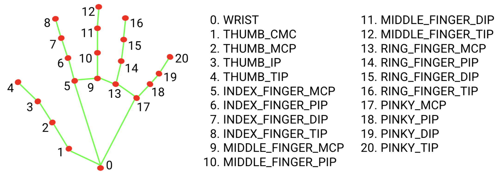
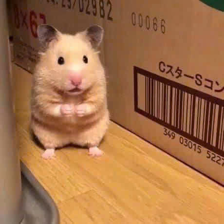

# Hamster-CV  Gesture Recognition

A simple, real-time hand gesture recognition project using OpenCV and Google's MediaPipe library. The application captures video from a webcam, detects hand landmarks, and classifies gestures for both left and right hands, displaying a cute hamster image corresponding to the detected gesture.



## How It Works

The application follows a simple pipeline:

1.  **Camera Capture:** It uses OpenCV to capture frames from the default webcam.
2.  **Hand Detection:** Google's MediaPipe `Hands` solution is used to detect the presence of hands and their 21 key landmarks in each frame. The solution is configured to detect up to two hands simultaneously.
3.  **Gesture Logic:** A custom `Detector` class processes the landmarks. It correctly identifies whether a hand is left or right and applies specific logic to determine which fingers are up.
4.  **Gesture Classification:** The finger state array (e.g., `[1, 0, 0, 0, 0]` for thumbs up) is mapped to a predefined gesture name.
5.  **UI Display:** The processed frame with landmarks drawn on the hands is displayed, along with an image representing the recognized gesture.

## Recognized Gestures

The following gestures are currently recognized:

| Gesture | Image |
| :---: | :---: |
| **FIST** |  |
| **FIVE** |  |
| **THUMBS UP** |  |
| **V (Peace)** |  |


## Setup and Installation

Follow these steps to get the project running on your local machine.

**1. Clone the repository:**

```bash
git clone https://github.com/YOUR_USERNAME/Hamster-CV.git
cd Hamster-CV
```
*(Remember to replace `YOUR_USERNAME` with your actual GitHub username)*

**2. Create a virtual environment (recommended):**
```bash
python -m venv venv
source venv/bin/activate  # On Windows, use `venv\Scripts\activate`
```

**3. Install dependencies:**

Install the required Python libraries using the `requirements.txt` file.

```bash
pip install -r requirements.txt
```

## Usage

To run the application, simply execute the `hamster.py` script:

```bash
python hamster.py
```

Two windows will open:
*   **Camera:** Shows the live feed from your webcam with hand landmarks overlaid.
*   **Hamster:** Shows an image corresponding to the first recognized gesture.

Press `q` to quit the application.

## Project Structure

```
.
├── hamster.py          # Main script to run the application
├── requirements.txt    # Project dependencies
├── images/             # Folder containing gesture images
│   ├── FIST.jpg
│   ├── FIVE.jpg
│   └── ...
└── src/
    ├── camera.py       # Handles webcam capture
    ├── detector.py     # Core logic for hand detection and gesture recognition
    └── ui.py           # Manages the OpenCV display windows
```
